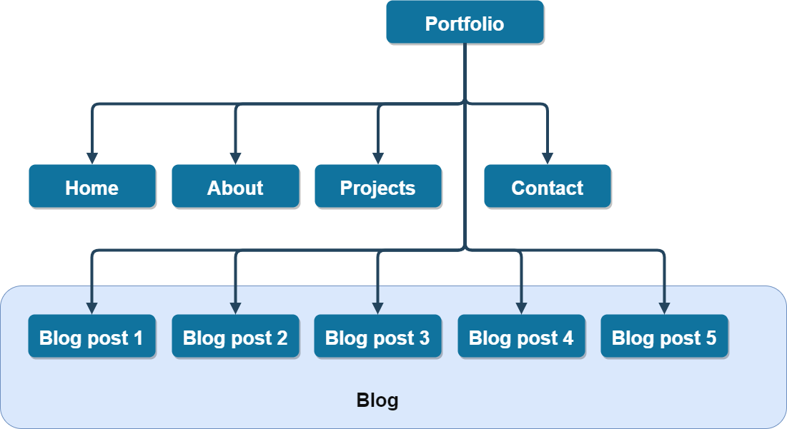

<h1 align="center"> Jason's Portfolio
</h1>

# Table of Contents
* [Links](#Links)
* [Purpose](#Purpose)
* [Features](#Features)
* [Sitemap](#Sitemap)
* [Screenshots](#Screenshots)
* [Target audience](#Target-audience)
* [Tech stack](#Tech-stack)
   

# Links
Published portfolio website : https://jasonkim7288.github.io

White theme website : http://iamjasonkim.s3-website-ap-southeast-2.amazonaws.com/

GitHub repository :  https://github.com/jasonkim7288/my_portfolio  

[Go back](#table-of-contents)   

# Purpose
Jason's portfolio is my professional portfolio website to show off my projects and skills to the potential employers. This website also contains blog posts I made and will be continuously maintained. For anyone who visit my website, there is a way how to contact me. 

[Go back](#table-of-contents)   

# Functionality and Features

This website is fully responisve from mobile to desktop, and there are aesthetic words animation at the background of the landing page and the contact page.   

### Main menu
For the phone sized screen, the menu list string becomes even smaller, but the menu icons appear to select the menu easily. If the screen is bigger than the phone size, the menu icons will be removed and the menu list string will be bigger.

### Linked icons
There are always 4 icons at the bottom of the all pages which are linked to GitHub, LinkedIn, Twitter, and Facebook.

### Landing page
The pure css type writing effect has been applied to introduce about who I am, and also two big meaningful words animation fades in.

### About page
About page is an introduction about me, and shows what I am capable of as a full stack developer.

### Projects page
Firstly, there is a link to download my resume pdf file, and then my latest projects' detailed information is posted.

### Blog page
Starting with the first blog page, you can navigate 5 blog pages and switch over to any other menu at any time.

### Contact page
You can send me a message through this page, and see the aesthetic words animation here as well. Once submiteed, the message is automatically sent to my email address and 'usebasin.com' submissions management service.

# Sitemap

# Screenshots
On the mail list screen, there is an option for creating a new email that allow you to send a simple email to anyone. 
Once whom to send, and what the subject is have been submitted, message body part can be written with a html format. You can still use only text except writing "\ " to make a new line ('Enter' key is not working). 
There is also a special function that "File attachment" is available if wanted. The file name has to include exact file path.

[Go back](#table-of-contents)   

# Target audience

## User interacion
When started, navigate the menu as below

## User experience
This Gmail program uses IMAP(Internet Message Access Protocol), so it will be much slower than the original Gmail app using [Google's official Gmail API Ruby Client](https://developers.google.com/gmail/api/quickstart/ruby).

[Go back](#table-of-contents)   

# Tech stack
## Flowchart

<strong>Click for the flowchart</strong>

