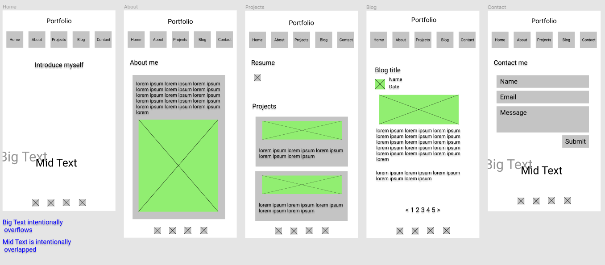
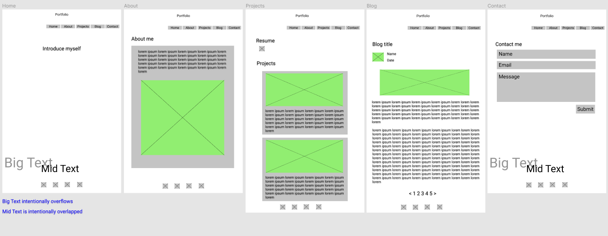
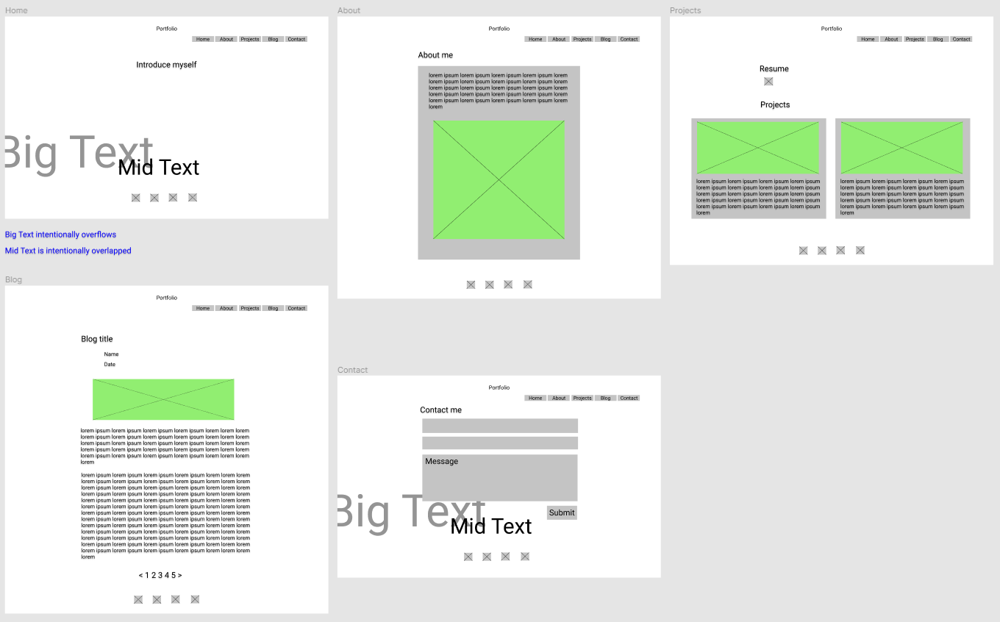

<h1 align="center"> Jason's Portfolio
</h1>

# Table of Contents

* [Links](#Links)
* [Purpose](#Purpose)
* [Functionality and Features](#Functionality-and-Features)
* [Sitemap](#Sitemap)
* [Screenshots](#Screenshots)
* [Target audience](#Target-audience)
* [Tech stack](#Tech-stack)
   

# Links

Published portfolio website : https://jasonkim7288.github.io

White theme website : http://iamjasonkim.s3-website-ap-southeast-2.amazonaws.com/

GitHub repository :  https://github.com/jasonkim7288/my_portfolio  

[Go back](#table-of-contents)   

# Purpose

Jason's portfolio is my professional portfolio website to show off my projects and skills to the potential employers. This website also contains blog posts I made and will be continuously maintained. For anyone who visit my website, there is a way how to contact me. 

[Go back](#table-of-contents)   

# Functionality and Features

This website is fully responisve from mobile to desktop, and there are aesthetic words animation at the background of the landing page and the contact page.   

### Main menu

For the phone sized screen, the menu list string becomes even smaller, but the menu icons appear to select the menu easily. If the screen is bigger than the phone size, the menu icons will be removed and the menu list string will be bigger.

### Linked icons

There are always 4 icons at the bottom of the all pages which are linked to GitHub, LinkedIn, Twitter, and Facebook.

### Landing page

The pure css type writing effect has been applied to introduce about who I am, and also two big meaningful words animation fades in.

### About page

About page is an introduction about me, and shows what I am capable of as a full stack developer.

### Projects page

Firstly, there is a link to download my resume pdf file, and then my latest projects' detailed information is posted.

### Blog page

Starting with the first blog page, you can navigate 5 blog pages and switch over to any other menu at any time.

### Contact page

You can send me a message through this page, and see the aesthetic words animation here as well. Once submiteed, the message is automatically sent to my email address and 'usebasin.com' submissions management service.

[Go back](#table-of-contents)   

# Sitemap

[Go back](#table-of-contents)   

# Screenshots
### Planning layouts
for phone (iPhone 8 plus)

for tablet (iPad pro)

for desktop

### Screenshots

#### Mobile screenshots (iPhone8 plus)

#### Tablet screenshots (iPad pro)

Tablet screenshots are almost same as desktop screenshots except there is only one project post per row. (desktop can have one to two based on it's screen size)

#### Desktop screenshots

[Go back](#table-of-contents)   

# Target audience

The target audience for my portfolio website is potential employers. This website allows them to see an overview of everything I have done so far and helps them to find many ways to contact me.

[Go back](#table-of-contents)   

# Tech stack

[Go back](#table-of-contents)   
